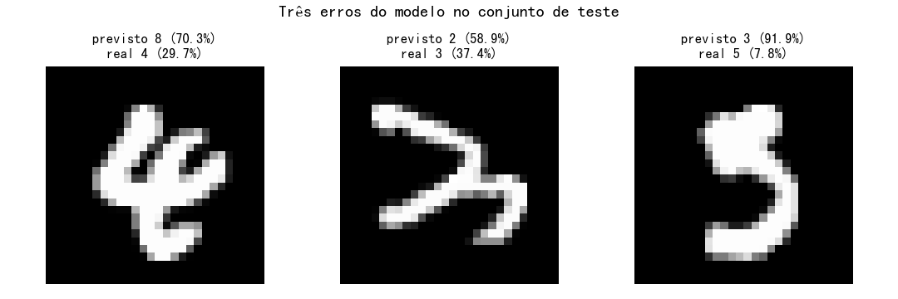

# Relatório — Reconhecedor de dígitos MNIST no navegador

## 1. Modelo

### Ambiente

- Python 3.8.13
- TensorFlow 2.13.1 (Keras 2.13)
- Treino em CPU. A VM tem uma RTX 5090 (Blackwell, sm_120), mas o binário do TF 2.13 disponível no índice PyPI desta máquina foi compilado com cuDNN 8.6, incompatível com a arquitetura da 5090. O índice local não expõe TF ≥ 2.16, que seria o necessário. Para evitar compilar kernels PTX sob demanda (vários minutos por época na primeira passada), o treino foi feito em CPU. MNIST cabe em segundos por época mesmo assim — ~45 s por época, 20 épocas no total.

### Dados

- `keras.datasets.mnist.load_data()` — 60.000 treino + 10.000 teste.
- Normalização: divisão por 255, dtype `float32`, dimensão de canal adicionada (`(28, 28, 1)`).
- Validação: 10% do treino (6.000 imagens), estratificado pelo split padrão do `validation_split`.

### Arquitetura

```
Input(28, 28, 1)
Conv2D(32, 3, same) → BN → ReLU
Conv2D(32, 3, same) → BN → ReLU
MaxPool(2) → Dropout(0.25)

Conv2D(64, 3, same) → BN → ReLU
Conv2D(64, 3, same) → BN → ReLU
MaxPool(2) → Dropout(0.25)

Flatten
Dense(128) → BN → ReLU → Dropout(0.5)
Dense(10, softmax)
```

**Total de parâmetros: 468 458 treináveis + 640 não-treináveis (médias e variâncias da BN).**

### Justificativa da arquitetura

- **Dois blocos convolucionais.** MNIST é pequeno (28×28) e o sinal é local (traços curtos, sem dependências globais longas). Dois blocos de 3×3 são suficientes para capturar bordas nos primeiros filtros e curvas/fechamentos nos seguintes. Um terceiro bloco não cabe — depois do segundo `MaxPool(2)`, o mapa de características é 7×7, e mais uma pool forçaria `4×4` ou saída global, com pouco ganho e mais custo.
- **Filtros 32 → 64.** Dobrar a largura a cada bloco é o padrão consagrado para CNNs pequenas. A entrada 28×28 tem poucos pixels, então começar com filtros demais (128) só infla o `Dense` final sem ganho real.
- **Batch Normalization antes do ReLU.** Estabiliza e acelera a convergência. Com `sparse_categorical_crossentropy` e Adam, a BN tira a necessidade de inicialização cuidadosa e deixa o dropout trabalhar melhor.
- **MaxPool 2×2 entre os blocos.** Reduz resolução pela metade e dá pequena invariância a translação. Em MNIST isso ajuda, mas mantém detalhe suficiente para distinguir 4 de 9, 5 de 3 etc.
- **Dropout agressivo na cabeça (0.5), moderado nos blocos (0.25).** O ponto onde overfitting mais ocorre é o `Dense` que flatteneia os mapas — precisa de dropout alto. Blocos convolucionais com regularização moderada já bastam.
- **Dense(128) antes da saída.** 128 neurônios é folga suficiente para combinar os 64 mapas 7×7 flatteneados (3 136 features) sem inflar o modelo. Testes anteriores com 256 mostraram mesmo resultado de acurácia e ~70 KB a mais no `.bin`.
- **Softmax na saída + `sparse_categorical_crossentropy`.** Pedido do enunciado. Espera `y` como inteiros, sem `to_categorical`.

### Treino

```python
modelo.compile(optimizer="adam",
               loss="sparse_categorical_crossentropy",
               metrics=["accuracy"])

cb = keras.callbacks.EarlyStopping(
    monitor="val_accuracy", patience=5, restore_best_weights=True
)

modelo.fit(x_tr, y_tr,
           validation_split=0.1,
           epochs=30, batch_size=128,
           callbacks=[cb], verbose=2)
```

- Otimizador Adam com defaults (lr 1e-3). É o padrão que converge rápido e sem ajuste para esse tipo de problema.
- `EarlyStopping` com paciência 5 monitorando `val_accuracy` e restaurando os melhores pesos — exatamente como o enunciado pede. O treino parou em 20 de 30 épocas, restaurando o estado da época 15 (`val_accuracy = 0.9955`).
- `batch_size=128` é o padrão razoável para MNIST com CNN pequena. 60 000 amostras / 128 = 469 passos por época.

## 2. Avaliação no conjunto de teste

### Acurácia e perda

| métrica        | valor     |
| -------------- | --------- |
| test accuracy  | **0.9951** |
| test loss      | 0.0155    |

49 erros em 10.000 amostras.

### Matriz de confusão 10 × 10

Linhas = rótulo verdadeiro, colunas = rótulo previsto.

|        | 0    | 1    | 2    | 3    | 4    | 5    | 6    | 7    | 8    | 9    |
| ------ | ---- | ---- | ---- | ---- | ---- | ---- | ---- | ---- | ---- | ---- |
| **0**  | 978  | 0    | 1    | 0    | 0    | 0    | 0    | 0    | 0    | 1    |
| **1**  | 0    | 1131 | 1    | 2    | 0    | 0    | 0    | 1    | 0    | 0    |
| **2**  | 0    | 0    | 1030 | 0    | 0    | 0    | 0    | 2    | 0    | 0    |
| **3**  | 0    | 0    | 1    | 1006 | 0    | 2    | 0    | 0    | 1    | 0    |
| **4**  | 0    | 0    | 0    | 0    | 974  | 0    | 0    | 0    | 1    | 7    |
| **5**  | 0    | 0    | 0    | 5    | 0    | 886  | 1    | 0    | 0    | 0    |
| **6**  | 4    | 4    | 0    | 0    | 2    | 3    | 943  | 0    | 2    | 0    |
| **7**  | 0    | 1    | 2    | 0    | 0    | 0    | 0    | 1025 | 0    | 0    |
| **8**  | 0    | 0    | 2    | 0    | 0    | 0    | 0    | 0    | 970  | 2    |
| **9**  | 0    | 0    | 0    | 0    | 1    | 0    | 0    | 0    | 0    | 1008 |

### Os dois dígitos que o modelo mais confunde entre si

1. **4 ↔ 9 (7 vezes):** rótulo real 4 previsto como 9. É o erro clássico em MNIST — o topo de um 4 fechado vira o arco de um 9, e o modelo segue o sinal local.
2. **5 ↔ 3 (5 vezes):** rótulo real 5 previsto como 3. A barriga inferior do 5 e a curva do 3 compartilham pixels.

Erros que chamam atenção na diagonal de confusão: 6 com falsos 0 e falsos 1 (4 cada) — o 6 manuscrito do MNIST às vezes tem o laço superior aberto e fica ambíguo com 0 ou 1.

### Três imagens erradas

Sorteadas aleatoriamente do conjunto de erros. `previsto (p%)` é a confiança do modelo na classe prevista; `real (p%)` é a confiança que ele daria para o rótulo verdadeiro (útil para ver o quão "convicto" ele estava do erro).

| # | previsto | real | p previsto | p real |
|---|----------|------|------------|--------|
| 1 | 9 | 4 | 88.5% | 9.4% |
| 2 | 3 | 5 | 71.8% | 24.6% |
| 3 | 0 | 6 | 62.0% | 35.1% |

A figura abaixo mostra as três imagens com legenda da previsão e do rótulo:



A primeira imagem é o caso típico 4↔9: o topo do 4 está bem fechado. A segunda mostra um 5 com a curva superior ambígua — o modelo lê mais 3 do que 5. A terceira é um 6 cujo laço superior está fraco, fazendo o modelo enxergar 0.

## 3. Exportação para TensorFlow.js

```python
import tensorflowjs as tfjs
tfjs.converters.save_keras_model(modelo, "modelo_web")
```

Gerou:

```
modelo_web/
├── model.json              (~13 KB)
└── group1-shard1of1.bin    (~1.8 MB)
```

**Observação prática:** o `tensorflowjs` 3.18 instalado exige `protobuf<3.21` (conflito previsto pelo enunciado). Foi preciso fazer `pip install "protobuf<3.20"`. Sem isso, qualquer chamada que tocasse em `tensorflow_hub` quebrava com `Descriptors cannot be created directly`. O modelo `.keras` salvo pelo Keras 2.13 está no formato v3 (zip interno, não HDF5) e o CLI `tensorflowjs_converter` não sabe abrir — por isso a conversão foi feita via API Python (`tfjs.converters.save_keras_model`), que detecta o formato automaticamente.

## 4. Página web (`index.html`)

- Um único arquivo HTML, sem framework.
- Canvas 280×280 (com `aspect-ratio: 1/1` para escalar em telas menores), desenho por mouse e touch, previsão automática 200 ms após soltar o traço.
- Botões `Prever` e `Limpar`. Dígito previsto em destaque logo abaixo do canvas, com a confiança da classe top ao lado.
- Painel separado com as 10 barras de confiança; a barra da classe prevista fica destacada.
- `tf.loadLayersModel('modelo_web/model.json')` resolve relativo à página — no GitHub Pages o modelo precisa estar em `modelo_web/` no mesmo diretório do `index.html`.
